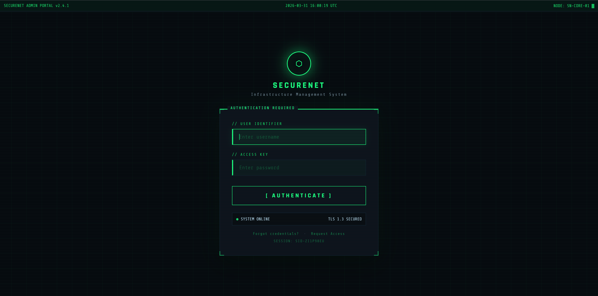
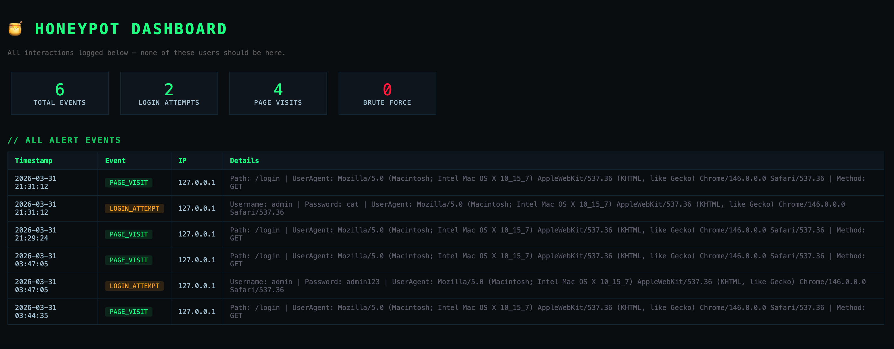

#  Cybersecurity And Network Security Research Internship Assessment Assignment


---

##  Overview

This repository contains two cybersecurity implementations built as part of internship assessment. Both tasks were built in Python and demonstrate real-world security concepts used in production systems.
> Note: The assessment required completing any 2 of 3 tasks. Task 1 and Task 3 were selected.

| Task | Name | Concept | Tech |
|------|------|---------|------|
| Task 1 | Tamper-Evident Logging System | Cryptographic hash chaining | Python, hashlib, JSON |
| Task 3 | Deception-Based Security Mechanism | Honeypot / fake login portal | Python, Flask, HTML/CSS |

> Both tasks are independent but conceptually connected. Task 3 detects attackers and logs their activity, Task 1 ensures those logs cannot be tampered with afterwards.

---

##  Repository Structure

```
cybersecurity-internship-assessment/
│
├── assets/
│   ├── dashboard.png              # Screenshot of Dashboard with logs
│   └── login.png                  # Fake login page screenshot
│
├── task1-tamper-evident-logging/
│   ├── README.md                  # Task 1 documentation
│   └── logger.py                  # Main implementation
│
├── task3-honeypot/
│   │── templates/
│   │    └── login.html            # Fake admin login portal UI
│   ├── README.md                  # Task 3 documentation
│   └── app.py                     # Flask honeypot server
│
└── README.md                      # This file
```

---

##  Conceptual Relationship Between Tasks

Both tasks are implemented as **independent systems**, but together they represent two complementary aspects of cybersecurity:

```
Attacker finds the honeypot (Task 3)
           ↓
Credentials and IP are logged to alerts.json
           ↓
Task 1 hash chain protects those logs
           ↓
Attacker tries to delete/modify logs
           ↓
Tamper detected → forensic evidence preserved

```
> While these systems are not directly integrated in this implementation, they reflect a real-world security architecture where detection and tamper-proof logging work together.

Together they can be made to form a two-layer security pipeline:
- **Layer 1 — Detection:** Honeypot catches attackers early
- **Layer 2 — Integrity:** Hash chain ensures evidence cannot be destroyed

---

##  Screenshots

###  Login Portal


###  Dashboard


---

##  Demo & Report

A full walkthrough video, report document, and additional screenshots are available here:

 [View Demo, Report & Assets](https://drive.google.com/drive/folders/12l2ERhBdpg-XuLBIeMvKV9ONW1TMgr_n?usp=drive_link)

---
##  Quick Setup

### Prerequisites
```bash
python --version    # Python 3.9+
pip install flask   # Only external dependency
```
